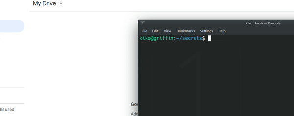

# Backup Client


Backup client is a simple cloud client, that uses Google Drive Api and can upload/download files from Google Drive.
All files (even their names) are encrypted before being uploaded to your drive account.


## Requirements
```
python 3.7
- google-api-python-client
- google-auth-httplib2
- google-auth-oauthlib
- pycrypto
```


## Quick start
- Linux:
  - Run [install.sh](./install.sh)
- [Enable](https://developers.google.com/drive/api/v3/quickstart/js) the drive API in your drive account.
- Download "credentials.json" and save it to ~/VAULT_CREDENTIALS.


## Usage
```
 vault [-h] [-v] [-f] [-o OUTPUT] action [action_arg]
 
 positional arguments:
  action                UPLOAD / DOWNLOAD / LIST
  action_arg            [file name]

optional arguments:
  -h, --help            show this help message and exit
  -v, --verbose         enable verbose mode
  -f, --force           overwrite files without asking
  -o OUTPUT, --output OUTPUT
                        selects output path
```

## Notes
- Vault works properly only if all the files on your cloud are encrypted and have been uploaded there using this Backup Client. Coexistence of encrypted and unencrypted files may be implemented later.
- If you accidentally delete "~.VAULT_CREDETENTIALS/key.secret", you lose all your files.
<p align="center"">
    
</p>


## Disclaimer!!!
###### This is just a simple weekend project and is not intended to be used in a real life.